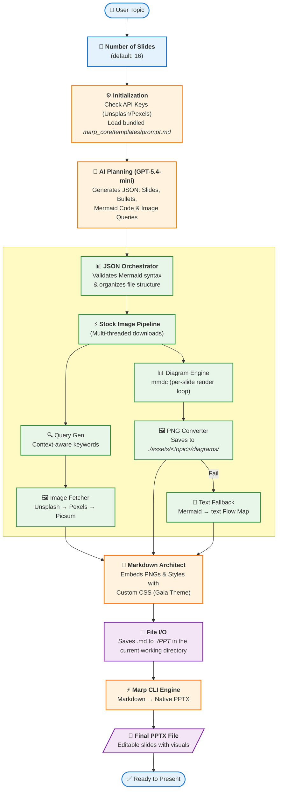

# Flow Diagram

This diagram shows the basic flow of how the code works.

```mermaid
flowchart TB
 subgraph ThreadPool[" "]
     direction TB
        T1["⚡ <b>Stock Image Pipeline</b><br>(Multi-threaded downloads)"]
        Parse["📊 <b>JSON Orchestrator</b><br>Validates Mermaid syntax<br>&amp; organizes file structure"]
        F1["🔍 Query Gen<br>Context-aware keywords"]
        F2["🖼️ Image Fetcher<br>Unsplash → Pexels → Picsum"]
        M1["📊 Diagram Engine<br>mmdc (per-slide render loop)"]
        M2["🖼️ PNG Converter<br>Saves to <i>./assets/&lt;topic&gt;/diagrams/</i>"]
        Fallback["📝 Text Fallback<br>Mermaid → text Flow Map"]
  end
    Start(["👤 User Topic"]) --> NumSlides["👤 <b>Number of Slides</b><br>(default: 16)"]
    NumSlides --> API["⚙️ <b>Initialization</b><br>Check API Keys (Unsplash/Pexels)<br>Load bundled <i>marp_core/templates/prompt.md</i>"]
    API --> GPT["🤖 <b>AI Planning (GPT-5.4-mini)</b><br>Generates JSON: Slides, Bullets,<br>Mermaid Code &amp; Image Queries"]
    GPT --> Parse
    Parse --> T1
    T1 --> F1 & M1
    F1 --> F2
    M1 --> M2
    M2 -- Fail --> Fallback
    F2 --> MD["📝 <b>Markdown Architect</b><br>Embeds PNGs &amp; Styles with<br>Custom CSS (Gaia Theme)"]
    M2 --> MD
    Fallback --> MD
    MD --> Save["💾 <b>File I/O</b><br>Saves .md to <i>./PPT</i> in the current working directory"]
    Save --> Marp["⚡ <b>Marp CLI Engine</b><br>Markdown → Native PPTX"]
    Marp --> Final[/"💾 <b>Final PPTX File</b><br>Editable slides with visuals"/]
    Final --> End(["✅ Ready to Present"])

     T1:::engine
     Parse:::tech
     F1:::engine
     F2:::engine
     M1:::engine
     M2:::engine
     Fallback:::engine
     Start:::user
     NumSlides:::user
     API:::tech
     GPT:::tech
     MD:::engine
     Save:::output
     Marp:::engine
     Final:::output
     End:::user
    classDef user fill:#e3f2fd,stroke:#1976d2,stroke-width:2px
    classDef tech fill:#fff3e0,stroke:#f57c00,stroke-width:2px
    classDef engine fill:#e8f5e9,stroke:#388e3c,stroke-width:2px
    classDef output fill:#f3e5f5,stroke:#7b1fa2,stroke-width:2px
    style Parse stroke:#388e3c,fill:#e8f5e9,stroke-width:2px,stroke-dasharray: 0
    style MD fill:#fff3e0,stroke:#FF6D00
    style Marp stroke:#FF6D00,fill:#fff3e0
    style ThreadPool fill:#FFF9C4
```
