# Function Flow Diagram

This diagram shows the complete flow of all Python functions in the Marp Presentation Generator, organized by execution path.

```mermaid
flowchart TB
    Start(["Entry: main()"]) --> Choice{"Mode<br>Selection"}
    
    %% Topic to PPTX Path
    Choice -->|"Topic to PPTX"| ShowAPI["show_api_status()<br/>Check API availability"]
    ShowAPI --> TopicPrompt["topic_to_ppt()<br/>Prompt for topic"]
    TopicPrompt --> GenPlan["generate_slide_plan(topic)<br/>Load prompt.md template<br/>Call OpenAI GPT-5.4-mini"]
    GenPlan --> ParseJSON["Parse JSON response<br/>Ensure title slide"]
    ParseJSON --> OptimizeDiagrams["optimize_diagram_placement(plan)<br/>Defer overcrowded diagrams<br/>to later slides"]
    
    %% Rendering Flow
    OptimizeDiagrams --> RenderStart["render_marpit_markdown()<br/>Setup Marp frontmatter<br/>& global CSS"]
    RenderStart --> QueryGen["choose_stock_image_query()<br/>Generate search terms<br/>from context"]
    QueryGen --> ImageDownload["download_stock_image()<br/>Parallel ThreadPoolExecutor"]
    
    %% Image Fetching Chain
    ImageDownload --> FetchUnsplash["_fetch_unsplash(query)<br/>Try Unsplash API"]
    FetchUnsplash -->|Fail| FetchPexels["_fetch_pexels(query)<br/>Try Pexels API"]
    FetchPexels -->|Fail| FetchPicsum["_fetch_picsum(index)<br/>Deterministic fallback"]
    FetchPicsum --> ImageReady["Return relative<br/>image path"]
    FetchUnsplash -->|Success| ImageReady
    FetchPexels -->|Success| ImageReady
    
    %% Per-Slide Rendering Loop
    ImageReady --> PerSlide["For each slide:<br/>render slide content"]
    PerSlide --> CheckMermaid["is_valid_mermaid()<br/>Validate diagram syntax"]
    CheckMermaid -->|Valid| RenderDiagram["convert_mermaid_to_png()<br/>Execute mmdc subprocess<br/>Validate PNG output"]
    RenderDiagram -->|Success| EmbedDiagram["Base64 embed PNG<br/>in markdown"]
    RenderDiagram -->|Fail| TextFallback["_extract_mermaid_aliases()<br/>_resolve_mermaid_node_label()<br/>Render text flow map"]
    CheckMermaid -->|Invalid| SkipDiagram["Skip diagram<br/>render code/chart instead"]
    TextFallback --> PerSlideEnd["Render bullets,<br/>speaker notes"]
    EmbedDiagram --> PerSlideEnd
    SkipDiagram --> PerSlideEnd
    
    %% Assembly
    PerSlideEnd --> CloseSlide["_build_closing_slide()<br/>Append THANK YOU slide"]
    CloseSlide --> SanitizeText["sanitize_text()<br/>camelcase_to_spaces()<br/>Normalize content"]
    SanitizeText --> MarkdownReady["Join slides with ---<br/>Final markdown ready"]
    MarkdownReady --> SaveMD["save_markdown(topic)<br/>Write to PPT/&lt;topic&gt;.md<br/>UTF-8 encoding"]
    
    %% PPTX Export (Path 1 & 2)
    SaveMD --> ExportPPTX["export_slides(md_path)<br/>Build Marp CLI args<br/>Execute subprocess"]
    
    %% Markdown to PPTX Path
    Choice -->|"Markdown to PPTX"| MDPrompt["markdown_to_ppt()<br/>Prompt for file path"]
    MDPrompt --> ValidateMD["Validate path<br/>Check .md extension<br/>File exists"]
    ValidateMD --> ExportPPTX
    
    %% Final Output
    ExportPPTX --> MarpCLI["Marp CLI Engine<br/>node/marp binary<br/>Timeout: 120s"]
    MarpCLI -->|Success| PPTXFile["PPTX file created<br/>Ready to present"]
    MarpCLI -->|Error| Diagnostics["Console error<br/>diagnostics"]
    PPTXFile --> End(["✅ Complete"])
    Diagnostics --> End
    
    %% Styling
    Start:::user
    Choice:::decision
    ShowAPI:::tech
    TopicPrompt:::user
    GenPlan:::tech
    ParseJSON:::engine
    OptimizeDiagrams:::engine
    RenderStart:::engine
    QueryGen:::engine
    ImageDownload:::engine
    FetchUnsplash:::engine
    FetchPexels:::engine
    FetchPicsum:::engine
    ImageReady:::engine
    PerSlide:::engine
    CheckMermaid:::engine
    RenderDiagram:::engine
    EmbedDiagram:::engine
    TextFallback:::engine
    SkipDiagram:::engine
    PerSlideEnd:::engine
    CloseSlide:::engine
    SanitizeText:::engine
    MarkdownReady:::engine
    SaveMD:::io
    ExportPPTX:::engine
    MDPrompt:::user
    ValidateMD:::tech
    MarpCLI:::engine
    PPTXFile:::output
    Diagnostics:::error
    End:::user
    
    classDef user fill:#e3f2fd,stroke:#1976d2,stroke-width:2px
    classDef tech fill:#fff3e0,stroke:#f57c00,stroke-width:2px
    classDef engine fill:#e8f5e9,stroke:#388e3c,stroke-width:2px
    classDef io fill:#f3e5f5,stroke:#7b1fa2,stroke-width:2px
    classDef output fill:#c8e6c9,stroke:#2e7d32,stroke-width:3px
    classDef error fill:#ffcdd2,stroke:#c62828,stroke-width:2px
    classDef decision fill:#fff59d,stroke:#f9a825,stroke-width:2px
```

## Function Directory

| Function | Module | Purpose |
|----------|--------|---------|
| `main()` | main.py | Entry point, mode selection router |
| `show_api_status()` | main.py | Display configured API keys |
| `topic_to_ppt()` | main.py | Orchestrate topic → PPTX workflow |
| `markdown_to_ppt()` | main.py | Orchestrate markdown → PPTX workflow |
| `generate_slide_plan(topic)` | marp_core/slide/generator.py | Call GPT-5.4-mini, return JSON slide plan |
| `optimize_diagram_placement(plan)` | marp_core/slide/diagram_optimizer.py | Defer diagrams from overcrowded slides |
| `render_marpit_markdown(plan, topic)` | marp_core/slide/renderer.py | Assemble final Marp markdown with images/diagrams |
| `_extract_mermaid_aliases(diagram)` | marp_core/slide/renderer.py | Parse node aliases from Mermaid code |
| `_resolve_mermaid_node_label(node_text, aliases)` | marp_core/slide/renderer.py | Resolve readable label for Mermaid node |
| `_build_closing_slide()` | marp_core/slide/renderer.py | Generate closing "THANK YOU" slide |
| `choose_stock_image_query(title, type, topic)` | marp_core/image/query_generator.py | Generate optimized image search terms |
| `download_stock_image(query, index, topic)` | marp_core/image/fetcher.py | Download single image with fallback chain |
| `_fetch_unsplash(query, filename)` | marp_core/image/fetcher.py | Fetch from Unsplash API |
| `_fetch_pexels(query, filename)` | marp_core/image/fetcher.py | Fetch from Pexels API |
| `_fetch_picsum(index, filename, topic)` | marp_core/image/fetcher.py | Fetch from picsum.photos fallback |
| `convert_mermaid_to_png(code, output, timeout)` | marp_core/utils/mermaid.py | Execute mmdc to render diagram PNG |
| `is_valid_mermaid(content)` | marp_core/utils/validators.py | Validate Mermaid diagram syntax |
| `sanitize_text(value)` | marp_core/utils/text.py | Normalize text input |
| `camelcase_to_spaces(text)` | marp_core/utils/text.py | Convert CamelCase to readable text |
| `save_markdown(topic, markdown)` | marp_core/io/file.py | Write markdown to PPT/<topic>.md |
| `export_slides(md_path)` | marp_core/export/marp.py | Execute Marp CLI, produce PPTX |

## Key Data Flow Points

1. **JSON Slide Plan Contract** → `generate_slide_plan()` returns structured JSON with slide metadata, diagrams, and image queries
2. **Image Path Resolution** → `download_stock_image()` returns relative markdown-friendly paths
3. **Diagram Rendering** → `convert_mermaid_to_png()` generates PNG files in `assets/<topic>/diagrams/`
4. **Markdown Assembly** → `render_marpit_markdown()` embeds images as base64 URIs or file references
5. **File Persistence** → `save_markdown()` writes final markdown to `PPT/` directory
6. **PPTX Export** → `export_slides()` invokes Marp CLI with prepared markdown

## Parallel Execution

- Image downloads execute in parallel via `ThreadPoolExecutor` within `render_marpit_markdown()`
- Per-slide diagram rendering is sequential (inline within rendering loop)
- Unsplash/Pexels/Picsum fallback chain is sequential per image
