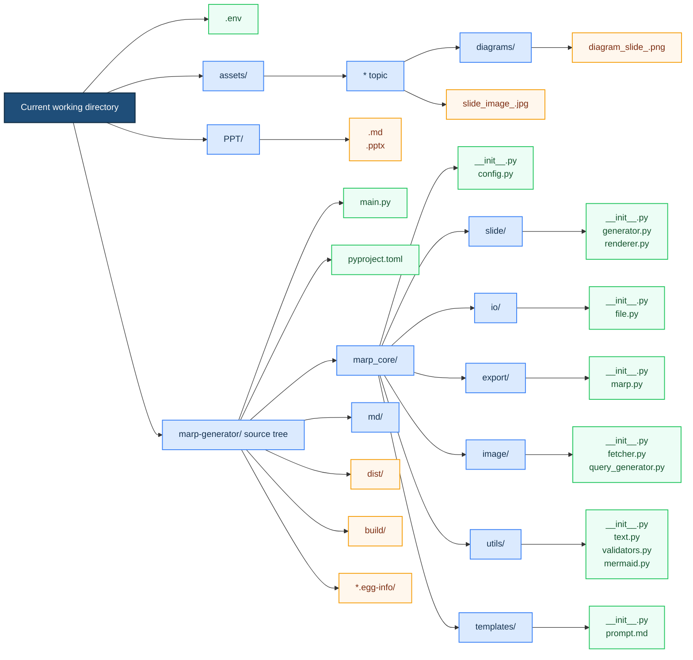

# Project Structure

This diagram shows the package source tree plus the runtime files created in the current working directory. For source runs, that launch directory is often the repo root. For an installed CLI, it is whichever folder you run `marp-gen` from.

