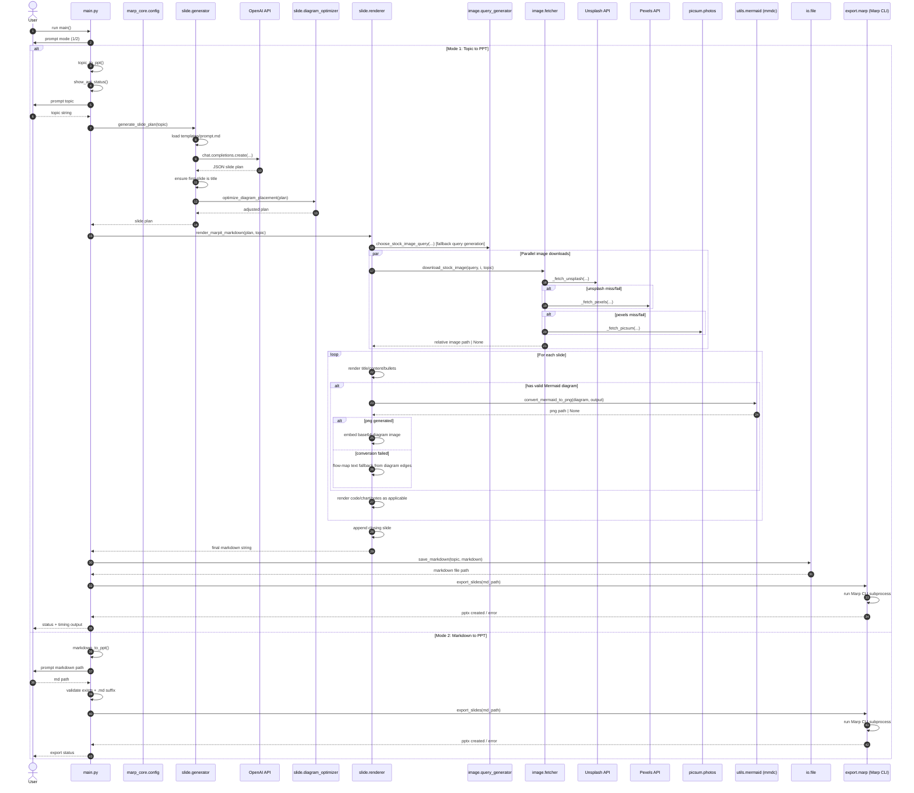

# Technical Architecture and End-to-End Flow

## Overview

This document explains the full technical flow of the Marp Presentation Generator, including:

- End-to-end execution paths
- Runtime sequence of actual function calls
- Module responsibilities
- Function-by-function behavior
- Data contracts and artifacts
- Failure handling and fallback behavior

For a visual representation of all Python functions and their interactions, see [Function Flow Diagram](function_flow_diagram.md).

---

## High-Level Execution Paths

The CLI supports two user workflows:

1. **Topic to PPTX**
   - User enters a topic.
   - The system generates a structured slide plan with OpenAI.
   - Images and diagrams are prepared.
   - Marp Markdown is rendered and saved.
   - Marp CLI exports a `.pptx`.

2. **Markdown to PPTX**
   - User supplies an existing `.md` file.
   - The system validates the file path.
   - Marp CLI exports a `.pptx` directly.

---

## Sequence Diagram of Actual Function Calls



---

## Runtime Data Contract

The OpenAI generator returns a JSON object with this expected shape:

```json
{
  "title": "...",
  "slides": [
    {
      "type": "title|content|diagram|code|chart",
      "title": "...",
      "subtitle": "...",
      "icon": "...",
      "image_query": "...",
      "bullets": ["..."],
      "diagram": "mermaid code or empty",
      "code": {"language": "...", "content": "..."},
      "chart": {"type": "...", "description": "...", "labels": [], "values": []},
      "speaker_notes": "..."
    }
  ]
}
```

### Consumption Mapping

- `type`, `title`, `subtitle`, `icon`, `bullets`, `speaker_notes` → slide text/layout in renderer.
- `image_query` → preferred image search term; renderer generates fallback query if missing.
- `diagram` → validated Mermaid; rendered to PNG or transformed to textual fallback.
- `code` → rendered fenced code block when no diagram is displayed.
- `chart` → rendered as markdown table when labels/values align.

---

## Module-by-Module Technical Details

## 1) `main.py` (Orchestration and CLI)

### `show_api_status()`
- Reads key presence from config constants.
- Prints whether Unsplash and Pexels are configured.
- Helps predict image source behavior before processing starts.

### `topic_to_ppt()`
- Prompts for topic; rejects empty input.
- Calls `generate_slide_plan(topic)`.
- Prints raw diagram content for debugging if present.
- Calls `render_marpit_markdown(plan, topic)`.
- Persists markdown with `save_markdown(...)`.
- Exports PPTX via `export_slides(...)`.
- Prints per-stage timing and total duration.

### `markdown_to_ppt()`
- Prompts for markdown file path.
- Validates non-empty input, existence, and `.md` extension.
- Calls `export_slides(...)` directly.

### `main()`
- Entry point and mode router.
- Accepts numeric and alias text inputs for both workflows.

---

## 2) `marp_core/config.py` (Global Configuration)

- Loads `.env` variables using `python-dotenv`.
- Exposes `OPENAI_API_KEY`, `UNSPLASH_API_KEY`, `PEXELS_API_KEY`.
- Defines output directories (`PPT/`, `assets/`) and creates them at import time.
- Provides shared constants:
  - Mermaid starter tokens (`MERMAID_VALID_STARTERS`)
  - `STOPWORDS` for query generation
  - API and download timeouts

---

## 3) `marp_core/slide/generator.py` (AI Planning)

### `generate_slide_plan(topic)`
- Reads bundled `marp_core/templates/prompt.md`.
- Substitutes `{topic}` safely with `replace(...)`.
- Calls OpenAI chat completions with:
  - model: `gpt-5.4-mini`
  - temperature: `0.2`
- Parses returned JSON string into Python dict.
- Enforces first slide as `type: title` via safety insertion if needed.
- Runs `optimize_diagram_placement(...)` to reduce overflow risk.

---

## 4) `marp_core/slide/diagram_optimizer.py` (Post-processing)

### `optimize_diagram_placement(slide_plan)`
- For each non-title slide, computes content volume:
  - bullet = 1
  - code block = 2
  - subtitle = 1
- If slide is crowded (`3+ bullets` and `volume >= 5`) and has valid diagram:
  - remove diagram from current slide
  - defer to next available non-title slide without diagram
- If no placement slot exists, diagram is dropped with warning.
- Uses reverse-order placement to reduce collisions/cascading issues.

---

## 5) `marp_core/slide/renderer.py` (Markdown Assembly Engine)

### Helper Functions

#### `_extract_mermaid_aliases(diagram)`
- Extracts `NodeId[Readable Label]` alias mapping.
- Used by diagram textual fallback rendering.

#### `_resolve_mermaid_node_label(node_text, aliases)`
- Resolves display label in priority order:
  1. explicit bracket label
  2. alias lookup
  3. CamelCase split fallback

#### `_build_closing_slide()`
- Returns static final “THANK YOU” slide markdown snippet.

### `render_marpit_markdown(slide_json, topic)`

#### A. Document setup
- Appends Marp frontmatter:
  - `marp: true`
  - `theme: gaia`
  - `paginate: true`
- Injects global CSS for typography, layout, code, tables, diagram images.

#### B. Image orchestration
- Builds slide-by-slide query map.
- Uses provided `image_query` where available.
- Otherwise computes query via `choose_stock_image_query(...)`.
- Adds query for generated closing slide.
- Downloads all images in parallel using `ThreadPoolExecutor`.

#### C. Per-slide rendering
- Sanitizes major fields before rendering.
- **Title slides**:
  - class directive + dark background
  - optional left-cover image
  - large title + subtitle
- **Content slides**:
  - optional right-cover image
  - diagram slides use narrower image strip to preserve space
  - renders heading and up to 4 bullets

#### D. Diagram behavior
- If valid Mermaid and slide density allows:
  - generate diagram PNG via `convert_mermaid_to_png(...)`
  - embed as base64 data URI in markdown (preferred)
  - fallback to file reference if base64 encoding fails
- If conversion fails:
  - parse Mermaid edges and render text flow map bullets
- If content is too dense even post-optimization:
  - skip diagram rendering to prevent overflow

#### E. Code and chart behavior
- Code block renders only when diagram is not being displayed.
- Charts render as markdown table when `labels`/`values` lengths match.
- Optional chart description is rendered as italic text.

#### F. Notes and final assembly
- Speaker notes are inserted as HTML comments.
- Appends fixed closing slide (+ optional image).
- Joins slides with `---`, preserving frontmatter/style block structure.

---

## 6) `marp_core/image/query_generator.py` (Query Construction)

### `choose_stock_image_query(title, slide_type, topic="")`
- Tokenizes topic + title.
- Removes stopwords.
- Prioritizes topic terms.
- Returns up to 4 search terms.
- Uses generic fallback terms when no meaningful tokens are present.

---

## 7) `marp_core/image/fetcher.py` (Image Acquisition)

### `_fetch_unsplash(query, filename)`
- Calls Unsplash search API for one landscape result.
- Downloads `urls.regular` image.

### `_fetch_pexels(query, filename)`
- Calls Pexels search API for one landscape result.
- Downloads `src.large2x` image.

### `_fetch_picsum(slide_index, filename, topic="")`
- Generates deterministic fallback image URL using topic+index seed.
- No API key required.

### `download_stock_image(query, slide_index, topic)`
- Creates topic-scoped asset directory.
- Tries sources in order: Unsplash → Pexels → Picsum.
- Prints timing/source diagnostics.
- Returns markdown-relative image path.

---

## 8) `marp_core/utils/mermaid.py` (Mermaid CLI Integration)

### `convert_mermaid_to_png(mermaid_code, output_path, timeout=30)`
- Normalizes LR/RL flow direction to TD for vertical readability.
- Injects Mermaid init config (theme/colors/spacing) if absent.
- Writes temp `.mmd` and executes `mmdc` subprocess.
- Validates output file existence, size, and PNG magic bytes.
- Cleans temporary file in `finally` block.
- Returns `None` on timeout/CLI errors/validation failures.

---

## 9) `marp_core/utils/validators.py` (Content Validation)

### `is_valid_mermaid(content)`
- Ensures non-empty content.
- Checks first token is recognized Mermaid starter.
- Requires minimum structural complexity:
  - at least 2 lines
  - and signs of node/edge syntax (`-->`, `[]`, `()`, `{}`, etc.)

---

## 10) `marp_core/utils/text.py` (Text Normalization)

### `sanitize_text(value)`
- Converts to string and trims whitespace.
- Returns empty string for falsy values.

### `camelcase_to_spaces(text)`
- Converts `CamelCase` identifiers into readable words.

---

## 11) `marp_core/io/file.py` (Output Persistence)

### `save_markdown(topic, markdown)`
- Converts topic to filename (`lowercase + underscores`).
- Writes markdown to `PPT/<topic>.md` with UTF-8 encoding.
- Returns absolute path string.

---

## 12) `marp_core/export/marp.py` (PPTX Export)

### `export_slides(md_file)`
- Resolves absolute markdown path.
- Builds marp args: `--pptx --allow-local-files --timeout=120000`.
- Windows strategy:
  - prefer direct `node .../marp-cli.js`
  - fallback to `marp` binary
- Unix strategy:
  - use `marp` directly
- Runs subprocess with timeout and status reporting.

---

## 13) Package and Build Metadata

- `pyproject.toml`:
  - package name/version/dependencies
  - CLI script entrypoint: `marp-gen = "main:main"`
  - includes `templates/*.md` in package data
- `marp_core/__init__.py` provides package metadata (`__version__`, `__author__`).
- subpackage `__init__.py` files are descriptive package docs.

---

## Failure Modes and Fallback Design

1. **OpenAI prompt resource missing** → immediate hard exit in generator.
2. **Model omits title slide** → title slide auto-inserted.
3. **Crowded slide with diagram** → diagram deferred to later slide.
4. **Image provider fails** → fallback chain to next provider, then picsum.
5. **Mermaid conversion fails** → textual flow-map fallback.
6. **Marp CLI missing/error/timeout** → clear console diagnostics.

---

## Generated Artifacts and Directory Layout

- `PPT/<topic>.md` → rendered Marp markdown
- `PPT/<topic>.pptx` → final presentation
- `assets/<topic>/slide_image_<n>.jpg` → downloaded slide images
- `assets/<topic>/diagrams/diagram_slide_<n>.png` → rendered diagram PNGs (when conversion succeeds)

---

## Operational Notes for Contributors

- This project is orchestration-heavy; business logic is concentrated in:
  - `slide/renderer.py`
  - `image/fetcher.py`
  - `utils/mermaid.py`
- Performance gains primarily come from parallel image downloads.
- Quality and layout stability rely on:
  - strict prompt schema
  - diagram deferral optimizer
  - defensive renderer fallbacks

